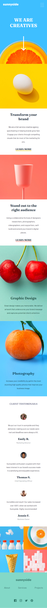

# Frontend Mentor - Sunnyside agency landing page solution

This is a solution to the [Sunnyside agency landing page challenge on Frontend Mentor](https://www.frontendmentor.io/challenges/sunnyside-agency-landing-page-7yVs3B6ef). Frontend Mentor challenges help you improve your coding skills by building realistic projects.

## Table of contents

- [Overview](#overview)
  - [The challenge](#the-challenge)
  - [Screenshot](#screenshot)
  - [Links](#links)
- [My process](#my-process)
  - [Built with](#built-with)
  - [What I learned](#what-i-learned)
  - [Continued development](#continued-development)
- [Author](#author)


## Overview

### The challenge

Users should be able to:

- View the optimal layout for the site depending on their device's screen size
- See hover states for all interactive elements on the page

### Screenshot




### Links

- Solution URL: [https://github.com/ibimina/sunnyside-agency-landing-page](https://github.com/ibimina/sunnyside-agency-landing-page)
- Live Site URL: [https://ibimina.github.io/sunnyside-agency-landing-page/](https://ibimina.github.io/sunnyside-agency-landing-page/)

## My process

### Built with


- CSS custom properties
- Flexbox
- CSS Grid
- Mobile-first workflow
- [React](https://reactjs.org/) - JS library


### What I learned

Design of the ul border box
```css
nav::after {
  content: "";
  top: -1.1rem;
  border-top: 40px solid transparent;
  border-right: 40px solid white;
  right: 0;
  position: absolute;
}
```

Opening and closing of the navigation menu in the mobile design when the hamburger icon is clicked
```jsx
function Header() {

const [icon,setIcon] =useState('false')
const [visible,setVisible]= useState('false')
const openMenu=()=>{
  if (icon==="false") {
    setIcon("true");
    setVisible("true")
  } else {
   setIcon("false");
   setVisible("false")
  }

}
    
    return (
      <>
        <header className="ii">
          <div className="head">
            
            <button
              className="mobile-navigation"
              aria-expanded={icon}
              onClick={openMenu}
            >
              <span className="sr-only">menu</span>
            </button>

            <Navigation visible={visible} />
          </div>
          <h1>
            WE ARE <span>CREATIVES</span>
          </h1>
       
          
        </header>
      </>
    );
}

export default Header;

```


### Continued development

React Framework


## Author
- Frontend Mentor - [@ibimina](https://www.frontendmentor.io/profile/ibimina)
- Twitter - [@ibiminaaH](https://www.twitter.com/ibiminaaH)


